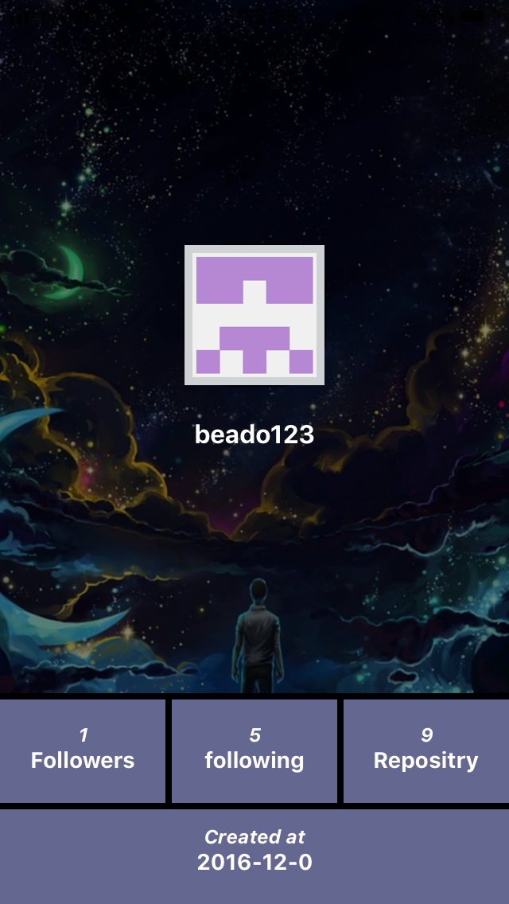
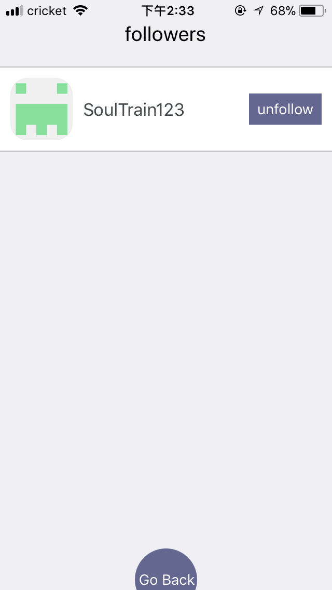
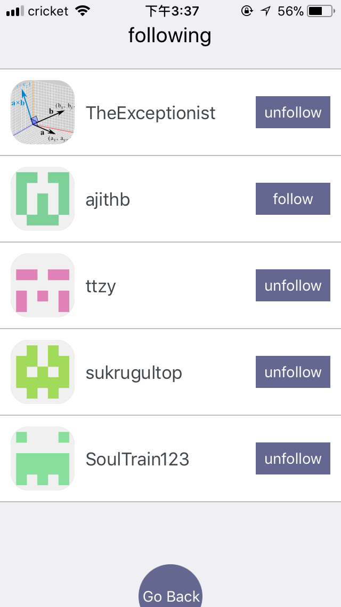
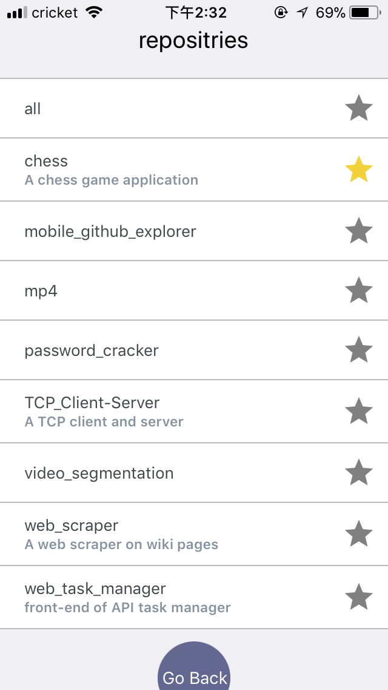
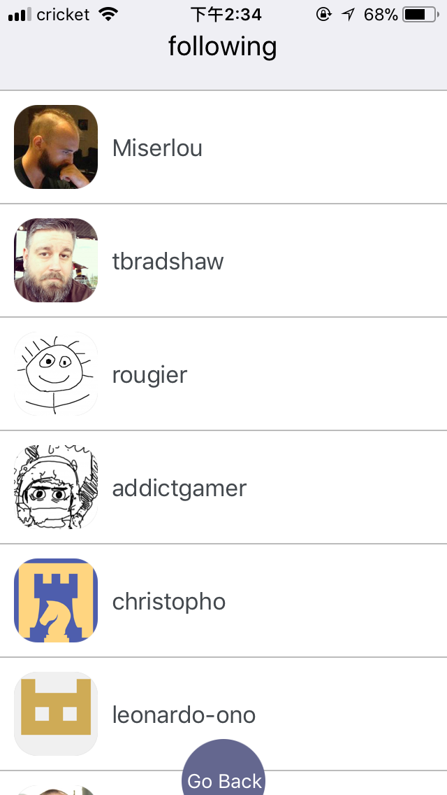
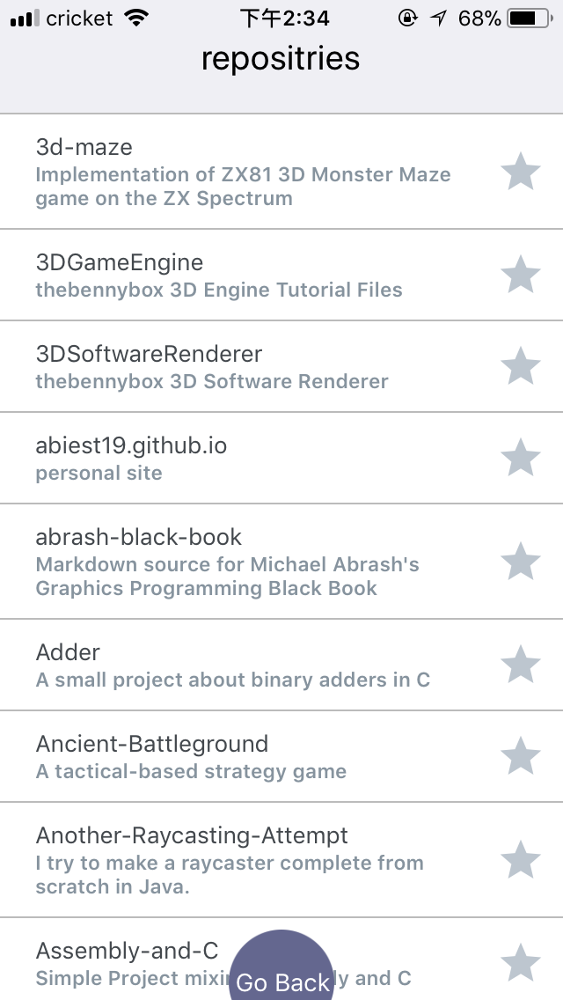

This project was bootstrapped with [Create React Native App](https://github.com/react-community/create-react-native-app).

An in-progress mobile app that explores your github profile and can follow/unfollow users, start/unstar repositries.

### Login Page
Uses Basic OAuth(username and passwords) to login and interact with github API.

### Profile Page
Shows basic information of the user, including number of followers, following, and repositries, create date.

### Following/Follower Page
* Lists following and followers of the user, can unfollow or follow the list of users.
* When pressing the right button to unfollow the user, the text on the button changes to 'follow'. Pull to refresh the list, the user disappears immediately. Go back to profile page and pull to refresh, number of following decrease by one. 

       

         

### Repositry Page
* Lists all the repositries of the user, can star or unstar a repositry.
* When pressing the grey star to start the repositry, the color of star changes to yellow. 

   

### View Other Users
Can view profile page, followers and following page of users that show up in your followers/following list.
   
