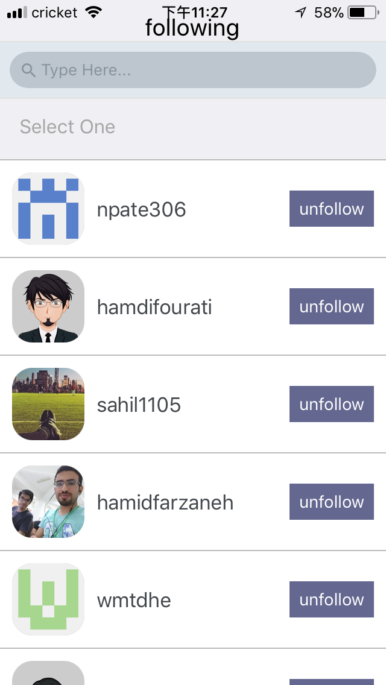

This project was bootstrapped with [Create React Native App](https://github.com/react-community/create-react-native-app).

An in-progress mobile app that explores your github profile and can follow/unfollow users, start/unstar repositries.

### Login Page
Uses Basic OAuth(username and passwords) to login and interact with github API.

### Profile Page
Shows basic information of the user, including number of followers, following, repositries, and create date.

### Following/Follower Page
* Lists following and followers of the user, can unfollow or follow the list of users.

     

* Can search the user by their names. Can sort users by their number of followers and create date. 

         

### Repository Page
* Lists all the repositories of the user, can star or unstar a repository.
* When pressing the grey star to star the repository, the color of star changes to yellow. 
* Can search the repositories by their names. Can sort repositories by star gazers count and create date. 

 

### View Other Users
Can view profile page, followers and following page of users that show up in your followers/following list.

    
